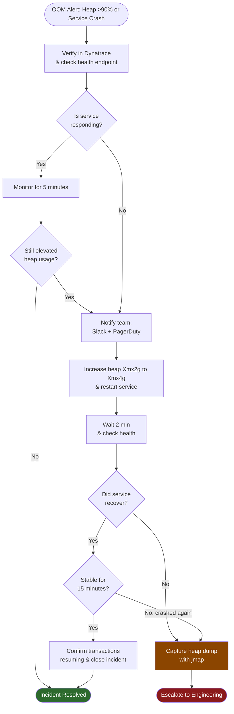

# Payment Service OOM Recovery — Decision Flowchart


```mermaid
```mermaid
graph TD
    A([OOM Alert: Heap >90% or Service Crash]) --> B[Verify in Dynatrace\n& check health endpoint]
    B --> C{Is service\nresponding?}
    C -- Yes --> D[Monitor for 5 minutes]
    D --> E{Still elevated\nheap usage?}
    E -- No --> F([Incident Resolved])
    E -- Yes --> G
    C -- No --> G[Notify team:\nSlack + PagerDuty]
    G --> H[Increase heap Xmx2g to Xmx4g\n& restart service]
    H --> I[Wait 2 min\n& check health]
    I --> J{Did service\nrecover?}
    J -- No --> K[Capture heap dump\nwith jmap]
    K --> L([Escalate to Engineering])
    J -- Yes --> M{Stable for\n15 minutes?}
    M -- No: crashed again --> K
    M -- Yes --> N[Confirm transactions\nresuming & close incident]
    N --> F

    style F fill:#2d6a2d,color:#fff
    style L fill:#8b1a1a,color:#fff
    style K fill:#8b4500,color:#fff
```
```
